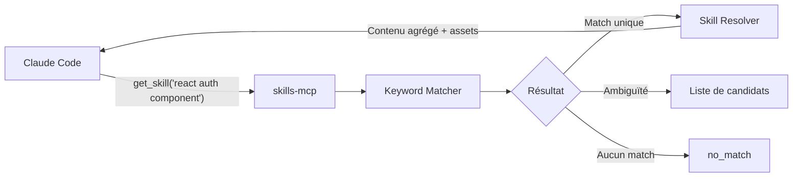

# skills-mcp

Serveur MCP (Model Context Protocol) qui expose un arbre de skills Markdown aux assistants IA comme Claude Code. Tourne en local, synchronise le contenu depuis un dépôt Git privé.

## Pourquoi skills-mcp

Les assistants IA générent du code sans connaître les conventions de votre équipe. Les fichiers `CLAUDE.md` ou les règles Cursor résolvent partiellement le problème, mais ils sont statiques, locaux, et chargés en bloc dans le contexte. **skills-mcp** prend une approche différente :

- **Référentiel centralisé et partagé.** Les skills vivent dans un dépôt Git. Toute l'équipe travaille avec les mêmes règles, versionnées et revues par PR.

- **Économie de contexte.** Un appel `get_skill` ne renvoie que le contenu pertinent pour la tâche en cours. Pas de chargement de milliers de lignes de règles non liées.

- **Routing déterministe par keywords.** Chaque skill déclare des mots-clés explicites. Le matching est algorithmique (pas de LLM, pas d'embedding) : prévisible, rapide, débogable.

- **Héritage hiérarchique.** Les règles communes sont factorisées dans des fichiers parents (`_root.md`, `_index.md`). Pas de copier-coller entre skills — une modification au parent se propage automatiquement.

- **Assets et scripts associés.** Chaque skill peut embarquer des templates, exemples, schémas et scripts d'automatisation, servis à la demande.

- **Contrôle d'accès granulaire.** Repo privé, branches protégées, review par PR — les pratiques de votre équipe sont gouvernées comme du code.

- **Évolutivité.** Ajouter un skill = ajouter un fichier `.md` avec un frontmatter YAML. Pas de configuration serveur, pas de redéploiement.

- **Observabilité et amélioration continue.** Analytics structurés + boucle de feedback (`report_usage`) pour identifier les skills manquants ou inefficaces.

- **Réutilisation cross-outil.** Le contenu est du Markdown pur, exploitable en dehors de MCP (documentation, onboarding, CI).

## Comment ça marche



Claude Code décrit sa tâche en texte libre. Le serveur tokenise la requête, score chaque skill par correspondance de keywords, puis résout l'héritage pour assembler le contenu final (du `_root.md` jusqu'au skill le plus spécifique). Les assets et scripts associés sont renvoyés en métadonnées, récupérables via `get_asset`.

## Outils MCP

| Outil | Description |
|-------|-------------|
| `get_skill` | Recherche un skill par contexte, renvoie le meilleur résultat avec son contenu |
| `list_skills` | Parcourt l'arbre des skills |
| `get_asset` | Récupère le contenu d'un asset ou script associé |
| `run_script` | Exécute un script côté serveur |
| `report_usage` | Envoie un feedback sur un skill |
| `refresh_skills` | Force un git pull et réindexe |

## Démarrage rapide

```bash
npm install
npm run build
```

Ajoutez le serveur dans le fichier `.mcp.json` de votre projet (ou dans `~/.claude/` pour une configuration globale) :

```json
{
  "mcpServers": {
    "skills": {
      "command": "npx",
      "args": ["@monorg/skills-mcp"],
      "env": {
        "SKILLS_REPO": "https://github.com/your-org/skills-content.git",
        "GITHUB_TOKEN": ""
      }
    }
  }
}
```

En mode développement (exécution depuis les sources) :

```json
{
  "mcpServers": {
    "skills": {
      "command": "npx",
      "args": ["tsx", "src/index.ts"],
      "env": {
        "SKILLS_REPO": "https://github.com/your-org/skills-content.git"
      }
    }
  }
}
```

> Pour l'installation détaillée, le mode local, et la configuration avancée (`config.yaml`), voir le [manuel utilisateur](docs/user-manual.md).

## Variables d'environnement

| Variable | Requis | Description |
|----------|--------|-------------|
| `SKILLS_REPO` | Oui | URL Git du dépôt de contenu skills |
| `SKILLS_BRANCH` | Non | Branche à suivre (défaut : `main`) |
| `GITHUB_TOKEN` | Non | Pour les dépôts privés |
| `ANALYTICS_ENDPOINT` | Non | URL webhook pour les analytics d'usage |
| `REFRESH_INTERVAL_MINUTES` | Non | Intervalle de rafraîchissement automatique (défaut : `15`) |

## Documentation

| Document | Contenu |
|----------|---------|
| [Manuel utilisateur](docs/user-manual.md) | Installation, configuration, écriture de skills, utilisation des outils, troubleshooting |
| [Spécification fonctionnelle](docs/functional-spec.md) | Architecture, algorithmes, diagrammes techniques, sécurité |
| [Analyse critique](docs/critical-analysis.md) | Valeur ajoutée, limites, compromis et public cible |
| [Propositions d'amélioration](docs/improvements.md) | Pistes d'évolution classées par effort et impact |
| [Analyse des systèmes de mémoire](docs/memory-systems-analysis.md) | Comparaison avec les serveurs MCP de mémoire, positionnement et complémentarité |
| [Recherche mémoire Claude Code](docs/claude-code-memory-research.md) | État de l'art des systèmes de mémoire natifs et communautaires, analyse pour skills-mcp |

## Commandes

```bash
npm run build        # Compile TypeScript vers dist/
npm run dev          # Exécute le serveur en mode dev (tsx)
npm run test         # Lance les tests (vitest)
npm run typecheck    # Vérification de types (tsc --noEmit)
npm run lint         # Lint (eslint)
```

## Licence

ISC
