# Systèmes de mémoire pour Claude Code — Recherche et analyse

> **Date de recherche :** 19 février 2026
> **Version Claude Code de référence :** 2.1.47
> **Sources :** documentation officielle Anthropic, repos GitHub, articles communautaires, issues GitHub

---

## Table des matières

**Partie 1 — État de l'art**

1. [Mécanismes natifs de Claude Code](#1-mécanismes-natifs-de-claude-code)
2. [Systèmes communautaires reconnus](#2-systèmes-communautaires-reconnus)
3. [Bonnes pratiques consensus](#3-bonnes-pratiques-consensus)
4. [Tableau comparatif](#4-tableau-comparatif)
5. [Tendances et insights clés](#5-tendances-et-insights-clés)
6. [Références](#6-références)

**Partie 2 — Analyse pour skills-mcp**

7. [Cartographie du paysage complet](#7-cartographie-du-paysage-complet)
8. [Positionnement de skills-mcp](#8-positionnement-de-skills-mcp)
9. [Opportunités concrètes](#9-opportunités-concrètes)
10. [Synthèse et recommandations](#10-synthèse-et-recommandations)

---

# Partie 1 — État de l'art

## 1. Mécanismes natifs de Claude Code

### 1.1 Hiérarchie CLAUDE.md

Claude Code charge automatiquement ces fichiers au lancement, dans un ordre de priorité décroissant :

| Niveau | Emplacement | Portée | Partagé avec |
|--------|-------------|--------|--------------|
| Enterprise policy | `/Library/Application Support/ClaudeCode/CLAUDE.md` (macOS), `/etc/claude-code/CLAUDE.md` (Linux), `C:\Program Files\ClaudeCode\CLAUDE.md` (Windows) | Organisation entière, déployé via MDM/Ansible/GPO | Tous les devs de l'organisation |
| User memory | `~/.claude/CLAUDE.md` | Préférences personnelles globales | Toi seul, tous projets |
| Project memory | `./CLAUDE.md` ou `./.claude/CLAUDE.md` | Standards de l'équipe sur le repo | L'équipe via source control |
| Project local | `./CLAUDE.local.md` | Préférences personnelles sur ce projet (auto-gitignored) | Toi seul, ce projet |

**Comportement de chargement :**

- **Récursif ascendant :** en partant du cwd, Claude Code remonte vers la racine et charge tous les fichiers CLAUDE.md et CLAUDE.local.md trouvés en chemin. Pratique dans les monorepos (ex: mémoire dans `foo/CLAUDE.md` et `foo/bar/CLAUDE.md`).
- **Lazy loading descendant :** les fichiers CLAUDE.md dans les sous-répertoires du cwd ne sont chargés qu'à la demande, quand Claude accède à des fichiers dans ces sous-arborescences. Économise du contexte.
- **Priorité :** les instructions plus spécifiques prennent le pas sur les instructions plus générales.

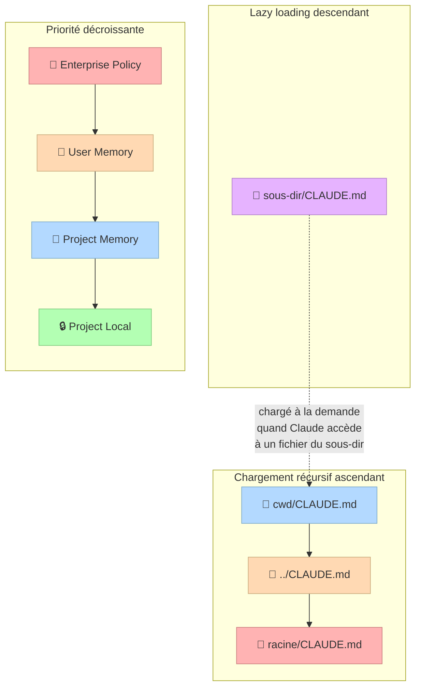

**Ajout rapide :** préfixer un message avec `#` pour ajouter une mémoire. Claude demandera dans quel fichier la stocker.

**Édition directe :** commande `/memory` pour ouvrir n'importe quel fichier mémoire dans l'éditeur système.

**Bootstrap :** commande `/init` pour générer un CLAUDE.md initial basé sur l'analyse du codebase.

### 1.2 Rules conditionnelles (`.claude/rules/`)

Tous les fichiers `.md` dans `.claude/rules/` sont automatiquement chargés comme mémoire de projet, avec la même priorité que `.claude/CLAUDE.md`.

**Scoping par fichiers via frontmatter YAML :**

```yaml
---
paths:
  - "src/api/**/*.ts"
---
# API Development Rules
- All API endpoints must include input validation
- Use the standard error response format
- Include OpenAPI documentation comments
```

Les rules sans champ `paths` s'appliquent inconditionnellement à tous les fichiers.

**Organisation en sous-dossiers :**

```
.claude/rules/
├── frontend/
│   ├── react.md
│   └── styles.md
├── backend/
│   ├── api.md
│   └── database.md
└── general.md
```

### 1.3 Auto Memory (`MEMORY.md`)

Introduit dans la v2.1.32 et déployé progressivement. C'est la mémoire que Claude écrit pour lui-même (contrairement aux CLAUDE.md que l'utilisateur rédige).

**Structure :**

```
~/.claude/projects/<project>/memory/
├── MEMORY.md              # Index concis, premières 200 lignes chargées au startup
├── debugging.md           # Notes détaillées sur les patterns de debug
├── api-conventions.md     # Décisions de design d'API
└── ...                    # Autres fichiers thématiques
```

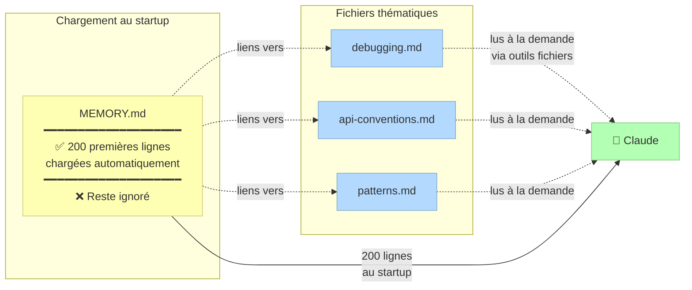

**Comportement :**

- Le chemin `<project>` est dérivé de la racine Git → tous les sous-répertoires d'un même repo partagent un seul répertoire de mémoire
- Les git worktrees obtiennent des répertoires de mémoire séparés
- Hors d'un repo Git, le working directory est utilisé
- **Limite dure :** seules les 200 premières lignes de MEMORY.md sont chargées dans le prompt système au démarrage
- Le contenu au-delà de 200 lignes n'est pas chargé automatiquement
- Claude est instruit de rester concis en déplaçant les notes détaillées dans des fichiers thématiques séparés
- Les fichiers thématiques (`debugging.md`, `patterns.md`) sont lus à la demande via les outils standard de fichiers
- Claude lit et écrit les fichiers mémoire pendant la session (visible dans l'interface)
- Ce sont des fichiers markdown éditables à tout moment par l'utilisateur

**Contrôle :**

```bash
export CLAUDE_CODE_DISABLE_AUTO_MEMORY=0  # Forcer ON
export CLAUDE_CODE_DISABLE_AUTO_MEMORY=1  # Forcer OFF
# Si aucune variable n'est set, suit le déploiement graduel
```

**Demandes explicites :** on peut dire directement à Claude de mémoriser quelque chose :
- "remember that we use pnpm, not npm"
- "save to memory that the API tests require a local Redis instance"

**Limites connues :**

- Limite dure de 200 lignes — le contenu au-delà n'est pas auto-chargé
- Qualité non contrôlée — Claude décide seul quoi retenir, peut manquer des choses importantes
- Risque de faux souvenirs — des notes incorrectes induiront en erreur les sessions futures
- Bloat — les fichiers s'accumulent avec le temps, nécessitent un nettoyage manuel
- Opacité — l'utilisateur peut ne pas savoir ce que Claude a enregistré sans vérifier le répertoire
- Coût en contexte — 200 lignes chargées à chaque démarrage consomment de la fenêtre de contexte

### 1.4 Compaction (gestion du contexte en session)

Quand la conversation approche 95% de la fenêtre de contexte, Claude Code déclenche une auto-compaction : résumé côté serveur de l'historique ancien. Efficace mais lossy — les détails fins sont perdus dans la synthèse.

**Problème documenté de drift comportemental :** après compaction, les références aux frameworks comportementaux définis dans CLAUDE.md sont paraphrasées dans le résumé. Claude voit "framework already discussed" et ne relit pas les fichiers source, causant une dérive progressive.

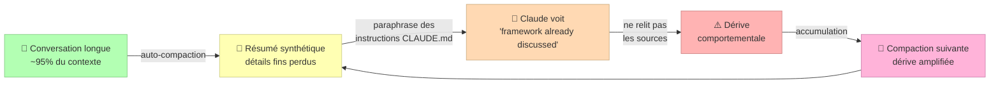

**Commandes :**

- `/compact` : compaction manuelle
- `/compact <instructions>` : compaction manuelle avec instructions spécifiques
- `/clear` : efface tout le contexte et redémarre la session (plus radical mais plus propre)
- `/context` : affiche le pourcentage de contexte utilisé

### 1.5 Système de Hooks

Les hooks permettent d'exécuter des scripts à des moments clés du cycle de vie. Configuration dans `~/.claude/settings.json` ou `.claude/settings.json` (projet) ou `.claude/settings.local.json` (local).

**Événements pertinents pour la mémoire :**

| Événement | Quand | Usage mémoire |
|-----------|-------|----------------|
| `SessionStart` | Démarrage ou reprise de session | Injection de contexte initial (git status, TODO, dernier handover) |
| `PreCompact` | Avant compaction (auto ou manuelle) | Sauvegarde du transcript, génération de handover |
| `SessionEnd` | Fin de session | Archivage, logging, statistiques |
| `Stop` | Quand Claude veut s'arrêter | Vérification que tout est fait, mise à jour mémoire |

**Types de hooks :**

- `command` : exécute un script shell (reçoit JSON sur stdin, stdout ajouté au contexte)
- `prompt` : un seul appel LLM pour évaluation
- `agent` : sous-agent multi-turn avec accès aux outils (Read, Grep, Glob)

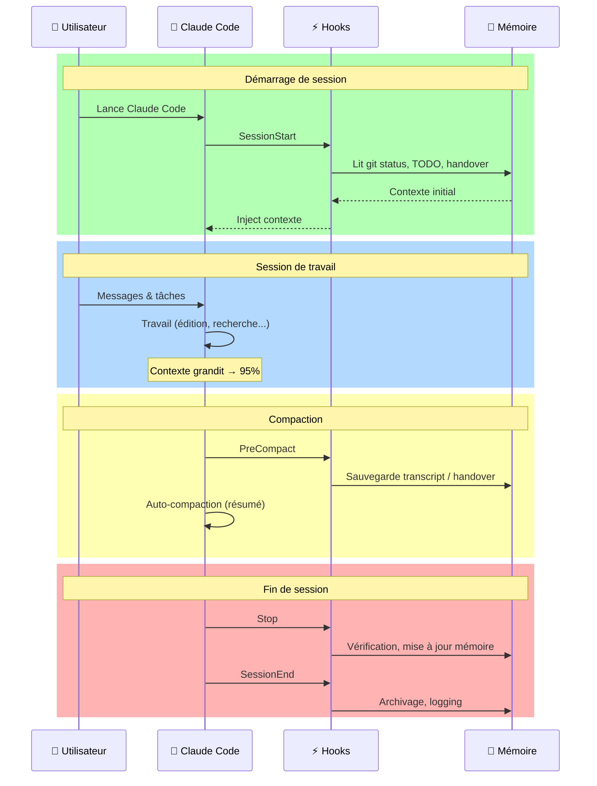

**Exemple SessionStart :**

```json
{
  "hooks": {
    "SessionStart": [{
      "hooks": [{
        "type": "command",
        "command": "git status --short && echo '---' && cat TODO.md"
      }]
    }]
  }
}
```

**Exemple PreCompact :**

```json
{
  "hooks": {
    "PreCompact": [{
      "matcher": "auto",
      "hooks": [{
        "type": "command",
        "command": ".claude/hooks/pre-compact-handover.py"
      }]
    }]
  }
}
```

**Matchers PreCompact :** `"auto"` (seulement compaction automatique), `"manual"` (seulement `/compact`), `"*"` (les deux).

### 1.6 Système d'imports `@`

Les fichiers CLAUDE.md peuvent importer d'autres fichiers avec la syntaxe `@path/to/file`.

```markdown
See @README for project overview and @package.json for available npm commands.

# Additional Instructions
- git workflow @docs/git-instructions.md
```

- Chemins relatifs et absolus supportés
- Imports récursifs (max 5 niveaux de profondeur)
- Non évalués à l'intérieur des blocs et spans de code markdown
- Alternative à `CLAUDE.local.md` qui fonctionne mieux avec les git worktrees multiples

**Pattern utile pour instructions individuelles par membre d'équipe :**

```markdown
# Individual Preferences
- @~/.claude/my-project-instructions.md
```

---

## 2. Systèmes communautaires reconnus

### 2.1 Beads — Tracker d'issues pour agents

| | |
|---|---|
| **Auteur** | Steve Yegge |
| **Repo** | `steveyegge/beads` |
| **Stars** | ~16.6k |
| **Type** | CLI Go + plugin Claude Code + MCP server optionnel |
| **Type de mémoire** | Procédurale (tâches, dépendances, graphe de travail) |

**Le problème résolu :** les agents qui utilisent des fichiers markdown pour la planification (TODO.md, PLAN.md) s'enlisent dans des documents conflictuels, obsolètes et ambigus. Quand plusieurs agents ou sessions travaillent en parallèle, le markdown devient un marécage.

**Architecture :**

```
Source de vérité: .beads/issues.jsonl (Git-tracked)
         ↕ auto-sync
Cache de lecture: SQLite local (rapide pour les requêtes)
```

- Hash-IDs (`bd-a1b2`) au lieu d'IDs séquentiels pour éviter les collisions en multi-agent
- JSONL append-only (une ligne par événement) → bon pour les merges Git
- Epics hiérarchiques avec issues enfants (profondeur arbitraire)
- 4 types de liens de dépendance (dont provenance pour le forensics)
- Tri topologique des tâches — `bd ready` retourne uniquement les tâches débloquées

**Installation :**

```bash
# Installer le CLI
curl -fsSL https://raw.githubusercontent.com/steveyegge/beads/main/scripts/install.sh | bash
# OU
brew install beads

# Initialiser dans le projet
cd your-project
bd init

# Configurer l'intégration Claude Code
bd setup claude  # Installe hooks SessionStart/PreCompact

# Dire à l'agent de l'utiliser
echo "Use 'bd' for task tracking" >> AGENTS.md
```

**Commandes clés :**

```bash
bd ready              # Tâches prêtes (non bloquées)
bd create "titre"     # Créer une issue
bd show <id>          # Détail d'une issue
bd list               # Lister les issues
bd dep tree <id>      # Visualiser les dépendances
bd prime              # Injecter ~1-2k tokens de contexte workflow
bd onboard            # Guide interactif
```

**Forces :**

- Très économe en tokens (~1-2k vs 10-50k pour les schémas MCP)
- L'outil fait le raisonnement (tri topologique, filtrage) à la place de l'agent
- Résistant aux merges Git grâce au format JSONL et aux hash-IDs
- Écosystème riche de TUIs et UIs communautaires
- Fonctionne avec Claude Code, Codex, Amp, et tout agent ayant accès au shell
- Mode stealth pour usage personnel sur des projets partagés
- Mode contributeur pour les forks OSS

**Limites :**

- Claude ne l'utilise pas proactivement — il faut dire "track this in beads" ou "check bd ready"
- Les instructions CLAUDE.md s'estompent en fin de session longue
- Session handoff reste manuel
- Le context rot persiste dans les sessions longues
- Ne couvre pas la mémoire sémantique ou épisodique (complémentaire, pas un remplacement)

### 2.2 Episodic Memory — Recherche vectorielle de conversations

| | |
|---|---|
| **Auteur** | Jesse Vincent (obra) |
| **Repo** | `obra/episodic-memory` |
| **Type** | Plugin Claude Code (partie de l'écosystème Superpowers) |
| **Type de mémoire** | Épisodique (conversations passées avec recherche sémantique) |

**Le problème résolu :** Claude conserve un enregistrement parfait de chaque conversation dans des fichiers `.jsonl` sous `~/.claude/projects`, mais il les supprime par défaut après un mois et ne les exploite pas. Les commentaires de code expliquent le *quoi*, la documentation explique le *comment*, mais la mémoire épisodique préserve le *pourquoi*.

**Architecture pipeline :**

```
Sync    → Copie les .jsonl depuis ~/.claude/projects vers l'archive
Parse   → Extrait les échanges user-agent du JSONL
Embed   → Génère des embeddings vectoriels (Transformers.js, local, offline)
Index   → Stocke dans SQLite avec sqlite-vec
Search  → Recherche sémantique par similarité vectorielle OU correspondance exacte
```

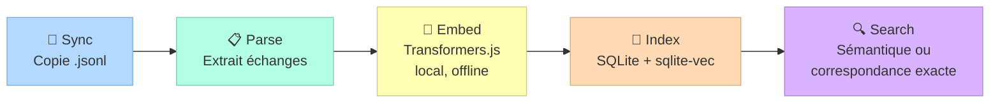

**Composants :**

1. Hook de startup qui archive automatiquement les conversations
2. Base SQLite avec recherche vectorielle pour la recherche sémantique
3. CLI pour chercher, formater en markdown/HTML
4. Serveur MCP pour l'interaction agent-mémoire
5. Skill (`.md`) qui enseigne à Claude quand et comment chercher sa mémoire épisodique
6. Sous-agent Haiku spécialisé pour gérer le bloat contextuel potentiel

**Configuration importante :** augmenter `cleanupPeriodDays` dans `~/.claude/settings.json` (ex: 99999) pour empêcher la suppression des transcripts.

**Impact rapporté :**

- Résolution de problèmes plus rapide (minutes vs réexploration du codebase)
- Meilleure continuité entre sessions
- Moins de répétitions
- Suggestions mieux informées

### 2.3 Claude Diary — Le cycle diary/reflect

| | |
|---|---|
| **Auteur** | Lance Martin (LangChain) |
| **Repo** | `rlancemartin/claude-diary` |
| **Type** | Plugin Claude Code (slash commands + hook PreCompact) |
| **Type de mémoire** | Sémantique (patterns, règles, préférences extraites par réflexion) |

**Inspiration :** article *Generative Agents* (Park et al., 2023) + interview de Cat Wu / Boris Cherny de l'équipe Claude Code mentionnant que des employés Anthropic utilisent des diary entries pour identifier des patterns.

**Le cycle en 3 étapes :**

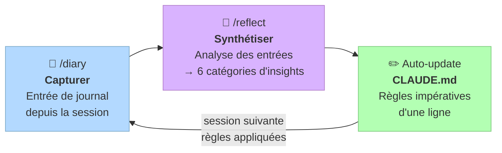

**Étape 1 : `/diary` — Capturer.** Crée une entrée de journal à partir de la session courante. Deux modes : automatique (hook PreCompact) ou manuel.

```json
{
  "hooks": {
    "PreCompact": [{
      "matcher": "auto",
      "hooks": [{
        "type": "command",
        "command": "bash ~/.claude/hooks/pre-compact.sh"
      }]
    }]
  }
}
```

**Étape 2 : `/reflect` — Synthétiser.** Analyse les entrées de journal accumulées et synthétise des insights à travers 6 catégories :

1. Feedback de code review (PR comments)
2. Préférences persistantes (style, outils, conventions)
3. Décisions de design qui ont fonctionné
4. Anti-patterns à éviter
5. Leçons d'efficacité
6. Patterns spécifiques au projet

Priorité la plus haute : scanner les violations des règles CLAUDE.md existantes pour les renforcer.

```bash
# Analyser les 20 dernières entrées non traitées
/reflect last 20 entries

# Plage de dates spécifique
/reflect from 2025-01-01 to 2025-01-31

# Filtrer par projet
/reflect for project /Users/username/Code/my-app
```

**Étape 3 : Auto-update CLAUDE.md.** Les réflexions sont écrites directement comme des règles impératives d'une ligne dans CLAUDE.md.

**Résultats concrets :**

- Git workflow : captures des préférences révélées
- Testing : patterns comme lancer les tests ciblés d'abord
- Code quality : éviter les conflits de nommage, le code verbeux
- Auto-correction : renforcement des règles CLAUDE.md quand des violations sont détectées

**Forces :**

- Système le plus minimaliste et élégant
- Les commandes sont juste des prompts → facilement modifiables
- Automatisation limitée intentionnellement (l'utilisateur contrôle quand diary/reflect)

### 2.4 Claude-Mem — Capture automatique exhaustive

| | |
|---|---|
| **Auteur** | Alex Newman (thedotmack) |
| **Repo** | `thedotmack/claude-mem` |
| **Type** | Plugin Claude Code |
| **Type de mémoire** | Épisodique + sémantique (capture automatique de tout) |

Un worker de fond capture automatiquement tout ce que Claude fait (éditions de fichiers, appels d'outils, décisions), compresse via l'Agent SDK de Claude, et réinjecte le contexte pertinent dans les sessions futures.

**5 outils MCP suivant un workflow à 3 couches efficace en tokens :**

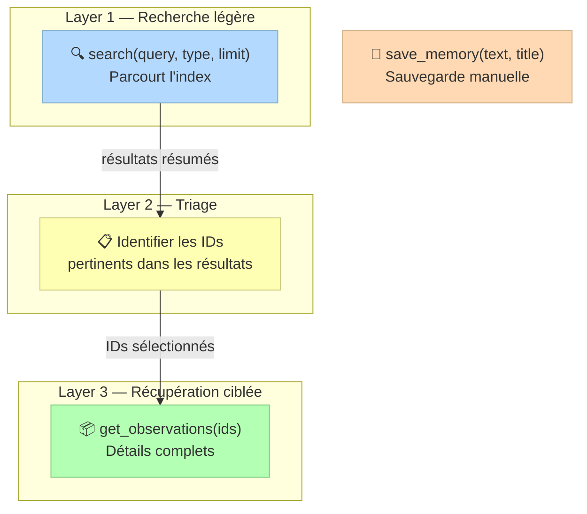

```javascript
// Layer 1: Rechercher l'index
search(query="authentication bug", type="bugfix", limit=10)

// Layer 2: Identifier les IDs pertinents dans les résultats

// Layer 3: Récupérer les détails complets
get_observations(ids=[123, 456])

// Sauvegarder manuellement une information importante
save_memory(text="API requires auth header X-API-Key", title="API Auth")
```

Interface web : `http://localhost:37777` pour visualiser et rechercher les observations.

Mode Endless (beta) : architecture biomimétique de mémoire pour sessions étendues.

### 2.5 MCP Memory Service — Couteau suisse cross-plateforme

| | |
|---|---|
| **Auteur** | doobidoo |
| **Repo** | `doobidoo/mcp-memory-service` |
| **Type** | Serveur MCP universel |
| **Type de mémoire** | Sémantique (embeddings vectoriels avec recherche multi-niveaux) |

**Le problème résolu :** après 50 utilisations d'outils, le contexte explose à 500k+ tokens. Claude ralentit, on redémarre, et on passe 10 minutes à ré-expliquer l'architecture.

**Architecture :**

- SQLite avec sqlite-vec pour les embeddings
- Recherche sémantique en 4 niveaux de performance : 50ms (instant) → 150ms (rapide) → 500ms (intensif)
- Intégration Git-aware pour la pertinence contextuelle
- Consolidation automatique de la mémoire
- Visualisation en graphe de force D3.js

**Compatibilité (la plus large de tous les systèmes) :** Claude Code, Cursor, Windsurf, Zed, JetBrains, VS Code, Claude Desktop, Raycast, LangGraph, CrewAI, AutoGen, ChatGPT (via MCP Developer Mode).

**Features clés :**

- Natural Memory Triggers v7.1.3 : détection sémantique de patterns avec 85%+ de précision
- Multi-tier performance (50ms → 150ms → 500ms)
- CLI management system pour configuration en temps réel
- Zero-restart installation avec chargement dynamique de hooks
- Support Windows, macOS, Linux

### 2.6 Memory Bank (Cline-derived)

| | |
|---|---|
| **Repos** | `hudrazine/claude-code-memory-bank`, `russbeye/claude-memory-bank`, `centminmod/my-claude-code-setup` |
| **Type** | Fichiers markdown structurés + slash commands |
| **Type de mémoire** | Déclarative (documentation structurée hiérarchique) |

Adapté de la méthodologie Cline Memory Bank pour Claude Code. Structure typique de 6-8 fichiers :

```
memory-bank/
├── projectbrief.md        # Vision, objectifs, périmètre
├── productContext.md       # Contexte produit, UX, personas
├── systemPatterns.md       # Patterns architecturaux, design
├── techContext.md          # Stack technique, dépendances, config
├── activeContext.md        # Contexte de travail courant
├── progress.md             # Avancement, tâches, blockers
├── decisions.md            # ADRs (Architecture Decision Records)
└── troubleshooting.md      # Problèmes rencontrés et solutions
```

**Consensus communautaire récent :** la tendance est au scepticisme. Un article influent (Cuong Tham, août 2025) recommande :

> "Memory Bank? Probably not worth it. Use `docs/` instead. Track tasks with checkboxes — Use `[ ]` in markdown files instead of complex memory systems."

**Limites :**

- Coût en contexte élevé (tous les fichiers chargés au startup)
- Risque de bloat et de dérive par rapport au code réel
- Maintenance manuelle
- Complexité excessive pour les petits projets

### 2.7 Simone — Framework de gestion de projet AI-native

| | |
|---|---|
| **Auteur** | Helmi |
| **Repo** | `Helmi/claude-simone` (485 stars) |
| **Type** | MCP + système de fichiers |
| **Type de mémoire** | Procédurale (processus, tâches, constitution comportementale) |

Plus qu'un système de mémoire, Simone est un framework de processus complet pour le développement assisté par IA. Fournit des prompts structurés et des outils pour la planification, l'exécution et le suivi de projet.

Deux implémentations : legacy (directory-based, en production) et MCP (en développement actif).

### 2.8 PreCompact Handover — Pattern communautaire de survie

| | |
|---|---|
| **Popularisé par** | @zarazhangrui (Twitter), puis itéré par la communauté |
| **Type** | Pattern (hook PreCompact + script) |
| **Type de mémoire** | Épisodique (snapshot structuré de l'état de travail au moment de la compaction) |

**Le problème résolu :** quand l'auto-compaction se déclenche, les détails précis sont perdus (messages d'erreur exacts, signatures de fonctions, décisions architecturales fines). Le résumé capture l'esprit mais pas la précision.

**Principe :**

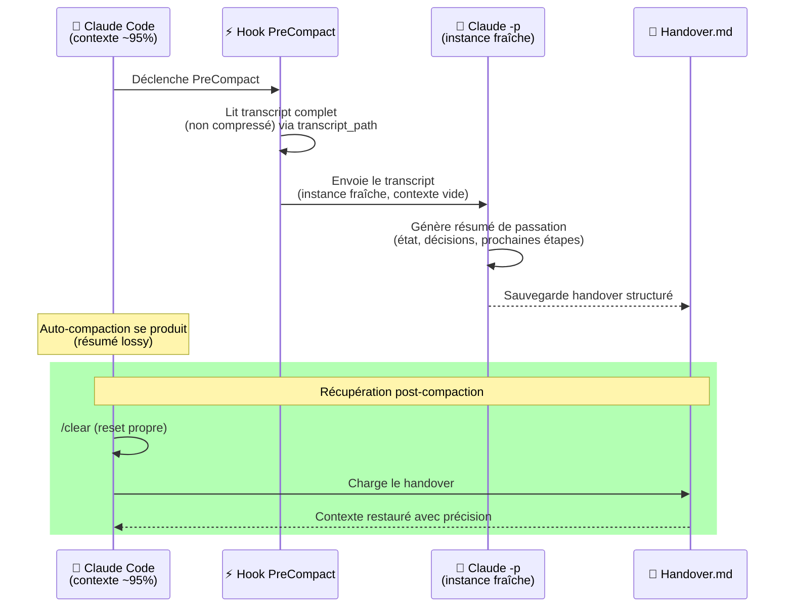

1. Hook PreCompact se déclenche avant la compaction
2. Le script lit le transcript complet (non compressé) via `transcript_path`
3. **Détail clé :** il appelle `claude -p` pour lancer une instance fraîche de Claude (car l'instance courante est déjà presque pleine) qui génère le résumé de passation
4. Le handover est sauvegardé dans un fichier markdown structuré
5. Après compaction, on charge ce fichier avec `/clear` + load

**Variante avancée — Context Recovery Hook (ClaudeFast) :**

```
.claude/hooks/ContextRecoveryHook/
├── backup-core.mjs          # Logique de backup partagée
├── statusline-monitor.mjs   # Détection de seuils + affichage
└── conv-backup.mjs           # Déclencheur du hook PreCompact
```

Monitoring proactif avec seuils multiples :
- 30% de contexte restant : capturer l'état (encore de la marge)
- 15% : compaction approche
- <5% : chaque tour pourrait être le dernier → backup continu

```json
{
  "statusLine": {
    "type": "command",
    "command": "node .claude/hooks/ContextRecoveryHook/statusline-monitor.mjs"
  },
  "hooks": {
    "PreCompact": [{
      "hooks": [{
        "type": "command",
        "command": "node .claude/hooks/ContextRecoveryHook/conv-backup.mjs",
        "async": true
      }]
    }]
  }
}
```

Le `async: true` sur PreCompact est important — les backups ne doivent pas ralentir la compaction.

---

## 3. Bonnes pratiques consensus

### 3.1 Garder CLAUDE.md minimal

La règle la plus répétée dans la communauté. La recherche montre que charger trop de contexte dégrade les performances — phénomène de "context rot" où la qualité se détériore même sans atteindre la limite technique. Il faut donner à Claude exactement ce dont il a besoin pour la tâche en cours, rien de plus.

**Règle pratique :** si un contenu n'est pas nécessaire dans CHAQUE session, il ne devrait pas être dans CLAUDE.md. Utiliser des fichiers séparés importés via `@` à la demande.

### 3.2 Structurer en couches

```
CLAUDE.md global (~/.claude/)     → Préférences universelles uniquement
CLAUDE.md projet (./CLAUDE.md)    → Commandes fréquentes, architecture, patterns
CLAUDE.local.md                   → URLs sandbox, configs locales, données test
docs/ ou fichiers @référencés     → Détails chargés à la demande
```

### 3.3 Être spécifique et impératif

- "Use 2-space indentation" — pas "Format code properly"
- Chaque mémoire = un bullet point
- Grouper les mémoires sous des titres markdown descriptifs

### 3.4 Revue périodique

Les fichiers de mémoire dérivent naturellement de la réalité. Lancer un prompt de maintenance mensuel (ou après des refactorings majeurs) qui demande à Claude de relire le code, comparer avec les CLAUDE.md, et mettre à jour ce qui a divergé.

### 3.5 Préférer `/clear` à `/compact`

Le consensus émergeant est que `/clear` pour les nouvelles tâches est préférable à `/compact` qui ne garantit pas la préservation des détails importants. Itérer sur de petits changements, puis `/clear`.

### 3.6 Utiliser les fichiers `docs/` plutôt que des systèmes complexes

Pour la plupart des projets, un dossier `docs/` avec des fichiers markdown référencés via `@` quand nécessaire est suffisant et plus maintenable qu'un système de mémoire élaboré.

### 3.7 Tracker les tâches avec des checkboxes

Utiliser `[ ]` dans des fichiers markdown est souvent suffisant et ne consomme pas de tokens pour des schémas d'outils MCP.

---

## 4. Tableau comparatif

| Système | Type de mémoire | Automatisation | Coût en tokens | Complexité setup | Agent-agnostic |
|---------|----------------|----------------|----------------|-------------------|----------------|
| **CLAUDE.md** (natif) | Déclarative (instructions) | Manuel (`#` shortcut, `/memory`) | Chargé au startup | Nulle | Non (Claude Code) |
| **Auto Memory** (natif) | Sémantique (auto-notes) | Totalement auto | 200 lignes max au startup | Nulle | Non (Claude Code) |
| **Rules** (natif) | Déclarative (conditionnelle) | Manuel | Chargé au startup (scopé) | Faible | Non (Claude Code) |
| **Beads** | Procédurale (tâches/dépendances) | Semi-auto | ~1-2k tokens | Moyenne | Oui (CLI) |
| **Episodic Memory** | Épisodique (conversations) | Auto (hook) | Variable (sous-agent Haiku) | Moyenne | Non (plugin CC) |
| **Claude Diary** | Sémantique (patterns/règles) | Semi-auto (`/diary` + `/reflect`) | Faible (met à jour CLAUDE.md) | Faible | Non (plugin CC) |
| **Claude-Mem** | Épisodique + sémantique | Totalement auto | Moyenne (compression AI) | Moyenne | Non (plugin CC) |
| **MCP Memory Service** | Sémantique (embeddings) | Auto (hooks + triggers) | Faible (hors contexte, retrieval) | Moyenne | Oui (MCP) |
| **Memory Bank** | Déclarative (docs structurés) | Semi-auto (slash commands) | Élevé (tout chargé au startup) | Faible | Non (Claude Code) |
| **Simone** | Procédurale (processus/tâches) | Semi-auto | Élevé | Élevée | Non (MCP/CC) |
| **PreCompact Handover** | Épisodique (snapshot session) | Auto (hook) | Nul entre sessions | Faible | Non (Claude Code) |

---

## 5. Tendances et insights clés

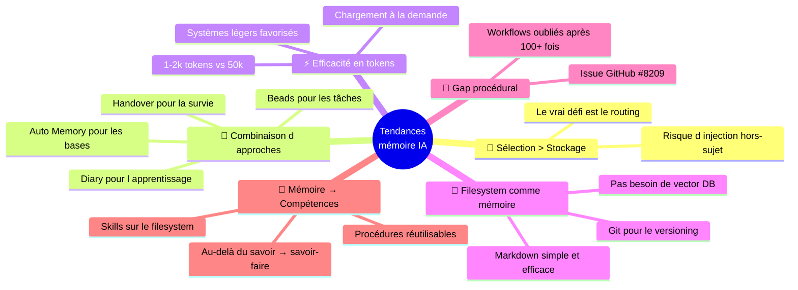

### Le problème fondamental n'est pas le stockage mais la sélection

Les agents populaires utilisent un ensemble étroit de fichiers toujours tirés dans le contexte (CLAUDE.md, rules). Quand un agent stocke une collection plus large de faits, la sélection du bon contexte au bon moment devient le vrai défi. ChatGPT illustre ce risque : Simon Willison a montré un cas où la sélection de mémoire a injecté sa localisation dans une image sans rapport.

### La tendance est à la combinaison d'approches complémentaires

Aucun système unique ne couvre tous les besoins. Les patterns émergents combinent :

- Auto Memory natif pour les patterns et conventions de base
- Beads (ou similaire) pour le suivi de tâches structuré
- Claude Diary (ou similaire) pour l'apprentissage continu et la mise à jour de CLAUDE.md
- PreCompact Handover pour la survie aux compactions

### L'efficacité en tokens prime sur la richesse des features

Avec les limites de rate et de tokens sur les plans Pro/Max, chaque token de contexte est précieux. La tendance est vers des systèmes légers (Beads à ~1-2k tokens, Claude Diary qui ne fait que mettre à jour CLAUDE.md) plutôt que des systèmes lourds qui chargent tout au startup.

### Le filesystem comme couche de mémoire naturelle

Le consensus émerge que les agents de codage ont déjà accès au filesystem — utiliser des fichiers markdown simples, lus à la demande, est souvent plus efficace et maintenable que des bases de données vectorielles complexes. Git fournit naturellement le versioning et la collaboration.

### La mémoire procédurale reste le plus grand gap

Un issue GitHub influent (#8209) documente que Claude Code oublie des workflows fondamentaux exécutés 100+ fois (FTP, requêtes DB directes) tout en retenant des détails de conversation ponctuels. La mémoire procédurale — la capacité à retenir et automatiser des compétences fréquemment utilisées — reste le talon d'Achille.

### L'évolution mémoire → compétences (skills)

La frontière avance : au-delà de la mémoire (ce que Claude sait), les systèmes commencent à évoluer vers l'extraction de compétences (ce que Claude sait *faire*). Lance Martin note que la réflexion sur les trajectoires peut distiller non seulement des mémoires mais des procédures réutilisables sauvegardées comme de nouvelles skills sur le filesystem.

---

## 6. Références

### Documentation officielle

- [Manage Claude's memory — Claude Code Docs](https://code.claude.com/docs/en/memory)
- [Hooks reference — Claude Code Docs](https://code.claude.com/docs/en/hooks)
- [Claude Code power user: How to configure hooks](https://code.claude.com/docs/en/hooks)

### Repos GitHub

- `steveyegge/beads` — Issue tracker pour agents (~16.6k stars)
- `obra/episodic-memory` — Recherche vectorielle de conversations
- `rlancemartin/claude-diary` — Cycle diary/reflect
- `thedotmack/claude-mem` — Capture automatique
- `doobidoo/mcp-memory-service` — MCP Memory Service
- `hudrazine/claude-code-memory-bank` — Memory Bank (Cline-derived)
- `centminmod/my-claude-code-setup` — Memory Bank starter template
- `Helmi/claude-simone` — Project management framework

### Articles et analyses

- Steve Yegge — *Introducing Beads* (oct 2025)
- Jesse Vincent — *Fixing Claude Code's amnesia* (oct 2025)
- Lance Martin — *Claude Diary* (déc 2025)
- Lance Martin — *Context Engineering for Agents* (juin 2025)
- Thomas Landgraf — *Claude Code's Memory: Working with AI in Large Codebases* (juin 2025)
- ClaudeFast — *Context Recovery Hook* (fév 2026)

---

# Partie 2 — Analyse pour skills-mcp

## 7. Cartographie du paysage complet

La Partie 1 documente les mécanismes natifs de Claude Code et les systèmes communautaires de mémoire. L'[analyse précédente](memory-systems-analysis.md) cartographiait les serveurs MCP de mémoire à usage général (Knowledge Graph, Basic Memory, Qdrant, Mem0). Ces deux panoramas couvrent des systèmes différents avec peu de recouvrement. Cette section les fusionne en une cartographie unifiée.

### Trois familles distinctes

| Famille | Exemples | Ce qu'elle fait | Pour qui |
|---------|----------|----------------|----------|
| **Natifs Claude Code** | CLAUDE.md, Auto Memory, Rules, Hooks, Compaction | Injection de contexte déclaratif et auto-notes au démarrage ; gestion du contexte en session | Tout utilisateur de Claude Code |
| **Communautaires spécialisés** | Beads, Episodic Memory, Claude Diary, PreCompact Handover | Comblent un gap précis (tâches, conversations passées, apprentissage, survie aux compactions) | Utilisateurs avancés, sessions longues |
| **Serveurs MCP de mémoire** | Knowledge Graph (Anthropic), Basic Memory, Qdrant MCP, Mem0, MCP Memory Service | Persistance généraliste entre sessions ; recherche sémantique ou structurée | Tout client MCP, cross-outil |

### Les deux axes de la « mémoire IA » (mise à jour)

L'analyse précédente identifiait deux axes : **Curatée vs Émergente** et **Lexicale vs Sémantique**. Les systèmes de la Partie 1 s'y intègrent naturellement :

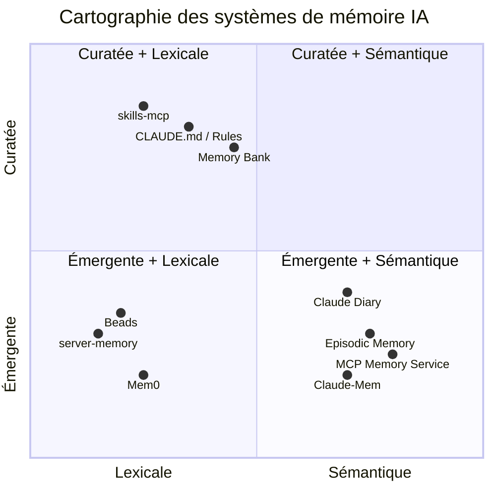

```
                         Curatée
                            │
             skills-mcp ────┤── CLAUDE.md / Rules
                            │      Memory Bank
                            │
         Lexicale ──────────┼──────── Sémantique
                            │
             Beads ─────────┤── Claude Diary
      server-memory ────────┤── Episodic Memory
                            │── MCP Memory Service
              Mem0 ─────────┤── Claude-Mem
                            │
                         Émergente
```

**Observation clé :** les systèmes natifs de Claude Code (CLAUDE.md, Rules) occupent le même quadrant que skills-mcp — **curatée + lexicale**. C'est à la fois une validation (le modèle fonctionne) et un risque de concurrence perçue. La section 8 approfondit ce point.

### Taxonomie par type de mémoire

La psychologie cognitive distingue des types de mémoire que l'on retrouve directement dans ces systèmes :

| Type cognitif | Description | Systèmes correspondants |
|---------------|-------------|------------------------|
| **Déclarative** | Faits et instructions explicites | CLAUDE.md, Rules, Memory Bank, skills-mcp |
| **Épisodique** | Souvenirs d'événements passés | Episodic Memory, Claude-Mem, PreCompact Handover |
| **Sémantique** | Connaissances abstraites et patterns | Auto Memory, Claude Diary, MCP Memory Service, Qdrant |
| **Procédurale** | Savoir-faire et workflows | Beads, Simone, *(gap principal — issue #8209)* |

skills-mcp est le seul système qui combine **mémoire déclarative** (le contenu des skills) avec une dimension **procédurale** (scripts et assets actionnables). C'est une niche unique.

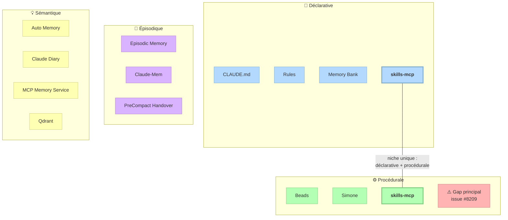

---

## 8. Positionnement de skills-mcp

### skills-mcp vs les mécanismes natifs

La question que tout utilisateur posera : **pourquoi skills-mcp quand CLAUDE.md et Rules existent déjà ?**

| Dimension | CLAUDE.md + Rules | skills-mcp |
|-----------|------------------|------------|
| **Qui rédige** | Chaque développeur, chaque projet | Équipe centralisée, contenu partagé |
| **Granularité du routing** | Tout ou rien (CLAUDE.md) ou par glob de fichiers (Rules) | Par domaine sémantique (keywords) |
| **Héritage** | Aucun (copier-coller entre projets) | Automatique (`_root.md` → skill leaf) |
| **Opérationnel** | Texte pur (instructions) | Texte + assets + scripts |
| **Distribution** | Copier le fichier dans chaque repo | Un seul dépôt Git, sync automatique |
| **Gouvernance** | Libre (chacun écrit ce qu'il veut) | PR + review (comme du code) |
| **Coût en contexte** | Chargé systématiquement au startup | Chargé à la demande (`get_skill`) |
| **Cross-outil** | Claude Code uniquement | Tout client MCP |

**Conclusion :** skills-mcp et CLAUDE.md ne sont pas en concurrence — ils sont complémentaires à deux niveaux différents. CLAUDE.md est la mémoire locale et personnelle ; skills-mcp est le référentiel partagé et gouverné. La bonne pratique est de combiner les deux : un CLAUDE.md léger qui *déclenche* l'appel à skills-mcp pour les conventions détaillées.

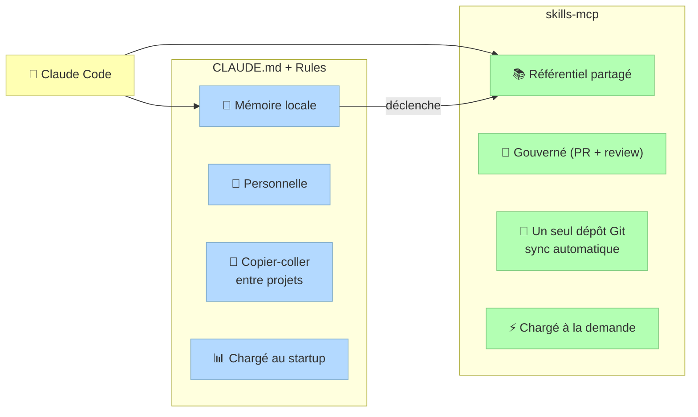

### skills-mcp vs les systèmes communautaires

| Dimension | Beads / Diary / Episodic | skills-mcp |
|-----------|--------------------------|------------|
| **Nature** | Mémoire émergente (accumulée par l'usage) | Connaissance curatée (rédigée par des humains) |
| **Persistance** | Intra-session ou inter-session | Indépendante des sessions |
| **Contenu** | Historique, tâches, patterns appris | Conventions, templates, procédures |
| **Maintenance** | Automatique ou semi-auto | Humaine (PR, review) |

Ici aussi, complémentarité pure. Un setup robuste utilise skills-mcp pour le **"quoi faire"** et un système comme Claude Diary pour le **"ce que j'ai appris"**.

### skills-mcp vs les serveurs MCP de mémoire

L'[analyse précédente](memory-systems-analysis.md) détaille cette comparaison. Les points clés restent :

- **Gouvernance par design** — aucun serveur de mémoire ne propose de workflow de revue
- **Héritage hiérarchique** — unique à skills-mcp
- **Assets et scripts** — dimension opérationnelle absente de la mémoire pure
- **Recall limité** — le gap sémantique reste la faiblesse principale

---

## 9. Opportunités concrètes

Les systèmes de la Partie 1 révèlent des patterns exploitables par skills-mcp. Voici les opportunités classées par priorité.

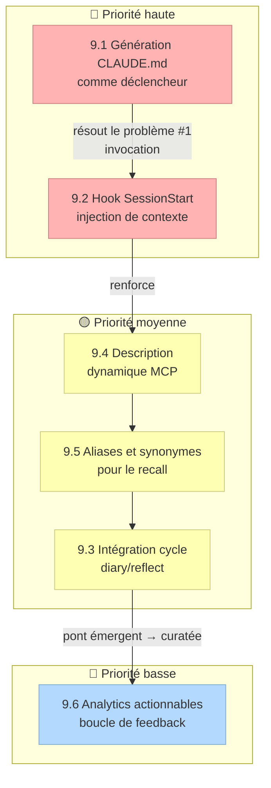

### 9.1 Génération CLAUDE.md comme déclencheur (priorité haute)

**Inspiré par :** la bonne pratique §3.1 (CLAUDE.md minimal) et le pattern Claude Diary (écrire dans CLAUDE.md).

**L'insight :** CLAUDE.md est le canal le plus fiable pour influencer Claude — il est chargé à chaque session. Mais le contenu de skills-mcp n'y apparaît pas. Résultat : Claude ne pense pas à appeler `get_skill`.

**Proposition :** `npx skills-mcp generate-claude-md` qui produit un bloc minimal à insérer dans le CLAUDE.md du projet :

```markdown
## Skills disponibles (skills-mcp)

Ce projet utilise skills-mcp pour les conventions de code.
Avant de générer du code, appelle `get_skill("<contexte>")`.

Domaines couverts : ui/react, api, infra, testing, database.
```

Ce bloc sert de pont entre le mécanisme natif le plus fiable (CLAUDE.md) et le système de skills à la demande. Coût : ~50 tokens au startup. Gain : invocation systématique.

**Déjà identifié dans :** [improvements.md §3](improvements.md).

### 9.2 Hook SessionStart pour injection de contexte (priorité haute)

**Inspiré par :** Beads (`bd prime` au SessionStart), Episodic Memory (archive au startup).

**L'insight :** les hooks SessionStart sont le moyen le plus fiable d'injecter du contexte au démarrage. skills-mcp pourrait fournir un hook qui détecte le type de projet et affiche les domaines de skills disponibles.

**Proposition :** un script `skills-mcp-session-hook` qui :
1. Détecte le type de projet (existence de `package.json`, `requirements.txt`, etc.)
2. Filtre les skills pertinents
3. Émet un résumé compact (~200 tokens)

```json
{
  "hooks": {
    "SessionStart": [{
      "hooks": [{
        "type": "command",
        "command": "npx skills-mcp session-context"
      }]
    }]
  }
}
```

**Connexion avec :** les [skills conditionnels](improvements.md) (§8) — la détection de projet sert aussi bien le hook que le filtrage de l'index.

### 9.3 Intégration avec le cycle diary/reflect (priorité moyenne)

**Inspiré par :** Claude Diary, la tendance "mémoire → compétences".

**L'insight :** Lance Martin observe que la réflexion sur les trajectoires peut distiller des *procédures réutilisables* — exactement ce que sont les skills. Le cycle diary/reflect pourrait alimenter skills-mcp.

**Proposition :** une commande `/reflect-to-skill` (ou un mode dans `report_usage`) qui :
1. Analyse les feedbacks accumulés et les patterns d'usage
2. Identifie les conventions émergentes non couvertes par un skill existant
3. Propose un brouillon de nouveau skill (frontmatter + contenu)

C'est le pont entre mémoire émergente et connaissance curatée : l'IA propose, l'humain review et merge.

### 9.4 Description dynamique MCP (priorité moyenne)

**Inspiré par :** MCP Memory Service (Natural Memory Triggers), la bonne pratique des descriptions d'outils enrichies.

**L'insight :** plusieurs serveurs MCP enrichissent dynamiquement la description de leurs outils avec le contenu disponible ("You have 47 memories about React..."). Cela augmente la probabilité d'invocation sans coût en contexte permanent.

**Proposition :** enrichir la description du tool `get_skill` avec un résumé compact des domaines :

```
Search skills by context. Available: ui/react (auth, forms, hooks),
api (rest, auth, middleware), infra (docker, ci), testing.
```

**Déjà identifié dans :** [improvements.md §3b](improvements.md).

### 9.5 Aliases et synonymes pour le recall (priorité moyenne)

**Inspiré par :** MCP Memory Service (recherche multi-niveaux), le gap sémantique documenté.

**L'insight :** tous les systèmes de mémoire utilisent la recherche sémantique sauf le Knowledge Graph d'Anthropic (et skills-mcp). Le passage à une recherche hybride est la direction naturelle. Mais un premier pas pragmatique est possible sans embeddings.

**Proposition :** champ `aliases` dans le frontmatter YAML pour déclarer des équivalences explicites. Reste déterministe, débogable, reviewable.

**Déjà identifié dans :** [improvements.md §1a](improvements.md).

### 9.6 Analytics actionnables comme boucle de feedback (priorité basse)

**Inspiré par :** Claude Diary (réflexion sur les patterns), la tendance "mémoire → compétences".

**L'insight :** les événements `no_match` et `ambiguity` de skills-mcp sont une mine d'or non exploitée. Claude Diary montre qu'analyser les trajectoires passées révèle des patterns non évidents.

**Proposition :** `npx skills-mcp report` qui analyse les analytics locales et propose :
- Keywords manquants pour les `no_match` récurrents
- Skills à créer pour les domaines non couverts
- Splits à envisager pour les ambiguïtés récurrentes

**Déjà identifié dans :** [improvements.md §6](improvements.md).

---

## 10. Synthèse et recommandations

### Position unique de skills-mcp

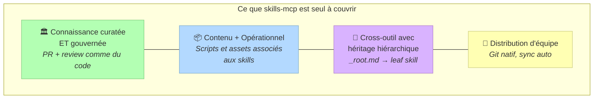

Dans le paysage complet des systèmes de mémoire pour Claude Code, skills-mcp occupe une niche que personne d'autre ne couvre :

1. **Seul système de connaissance curatée et gouvernée** — les natifs (CLAUDE.md) sont curatés mais locaux et non gouvernés ; les communautaires sont émergents et automatiques
2. **Seul système combinant contenu + opérationnel** — les scripts et assets associés aux skills n'ont pas d'équivalent dans les systèmes de mémoire
3. **Seul système cross-outil avec héritage hiérarchique** — les serveurs MCP de mémoire sont cross-outil mais sans structure hiérarchique
4. **Seul système optimisé pour la distribution d'équipe** — Git natif, PR review, sync automatique

### Architecture cible recommandée

Pour un utilisateur avancé, l'architecture optimale combine skills-mcp avec les mécanismes natifs :

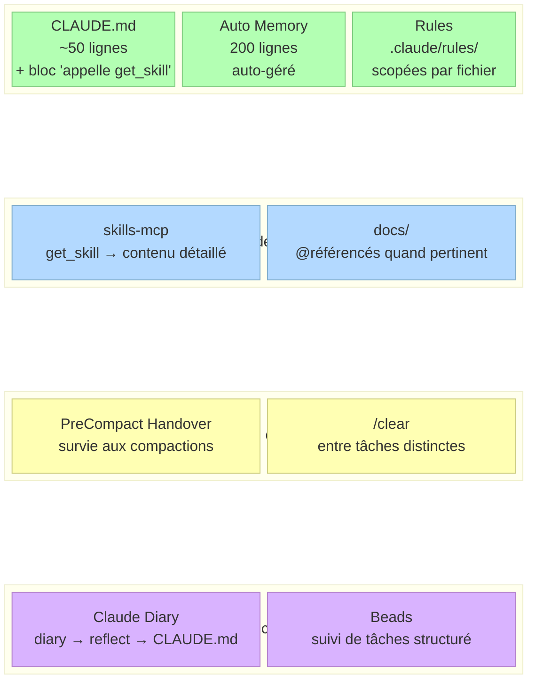

```
┌─ Toujours en contexte ─────────────────────────┐
│  CLAUDE.md (léger, ~50 lignes)                  │
│  └── Inclut un bloc "appelle get_skill"         │
│  Auto Memory (200 lignes, auto-géré)            │
│  Rules (.claude/rules/, scopées par fichier)    │
└─────────────────────────────────────────────────┘

┌─ À la demande ──────────────────────────────────┐
│  skills-mcp (get_skill → contenu détaillé)      │
│  docs/ (@référencés quand pertinent)            │
└─────────────────────────────────────────────────┘

┌─ Gestion de session ────────────────────────────┐
│  PreCompact Handover (survie aux compactions)   │
│  /clear entre tâches distinctes                 │
└─────────────────────────────────────────────────┘

┌─ Apprentissage continu (optionnel) ─────────────┐
│  Claude Diary (diary → reflect → CLAUDE.md)     │
│  Beads (suivi de tâches structuré)              │
└─────────────────────────────────────────────────┘
```

### Priorités d'implémentation pour skills-mcp

| Priorité | Action | Effort | Impact |
|----------|--------|--------|--------|
| **1** | Génération CLAUDE.md déclencheur | Faible | Résout le problème #1 (invocation) |
| **2** | Description dynamique MCP | Faible | Renforce l'invocation |
| **3** | Hook SessionStart | Moyen | Injection de contexte fiable |
| **4** | Aliases/synonymes | Faible | Améliore le recall |
| **5** | Analytics actionnables | Moyen | Boucle d'amélioration continue |
| **6** | Intégration cycle diary/reflect | Élevé | Pont émergent → curatée |

Les actions 1-2 sont à faible effort et adressent la faiblesse la plus critique (l'invocation volontaire). Elles devraient être implémentées en premier.
