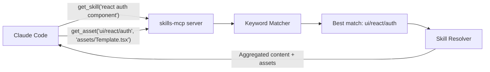
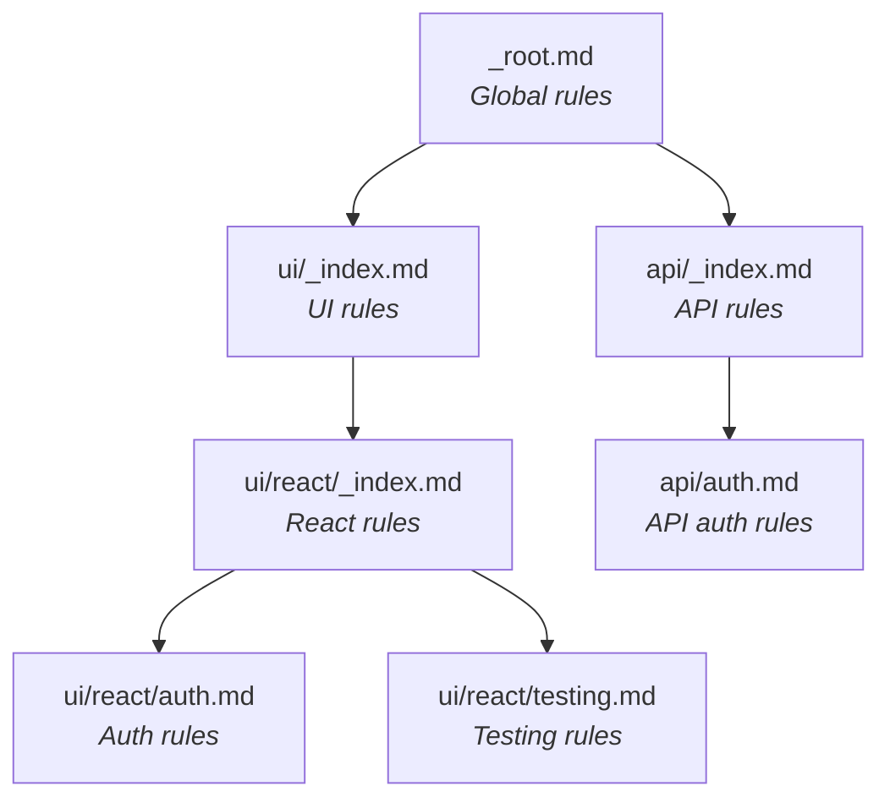

# skills-mcp User Manual

## Table of Contents

- [Overview](#overview)
- [Installation](#installation)
- [Configuration](#configuration)
  - [Git mode (team usage)](#git-mode-team-usage)
  - [Local mode (development)](#local-mode-development)
  - [Environment variables](#environment-variables)
  - [config.yaml](#configyaml)
- [Using the MCP tools](#using-the-mcp-tools)
  - [get_skill — Find a skill](#get_skill--find-a-skill)
  - [list_skills — Browse the skill tree](#list_skills--browse-the-skill-tree)
  - [get_asset — Retrieve a file](#get_asset--retrieve-a-file)
  - [run_script — Execute a server-side script](#run_script--execute-a-server-side-script)
  - [report_usage — Give feedback](#report_usage--give-feedback)
  - [refresh_skills — Sync latest content](#refresh_skills--sync-latest-content)
- [Writing skills](#writing-skills)
  - [Skill file format](#skill-file-format)
  - [Directory structure](#directory-structure)
  - [Naming conventions](#naming-conventions)
  - [Parent resolution and inheritance](#parent-resolution-and-inheritance)
  - [Adding assets](#adding-assets)
  - [Adding scripts](#adding-scripts)
  - [Keyword best practices](#keyword-best-practices)
- [Troubleshooting](#troubleshooting)

---

## Overview

**skills-mcp** is a Model Context Protocol (MCP) server that exposes a tree of Markdown-based developer skills to Claude Code. It runs locally on each developer's machine, syncing skill content from a shared Git repository.

When Claude Code needs guidance, it calls `get_skill` with a description of the task. The server matches keywords, resolves inheritance, and returns the most relevant skill content along with any associated templates, examples, or scripts.



---

## Installation

### Prerequisites

- Node.js >= 18
- Git (for syncing skills from a remote repository)
- Claude Code CLI

### Install from GitHub Packages

```bash
npm login --registry=https://npm.pkg.github.com
npm install -g @monorg/skills-mcp
```

### Install from source (development)

```bash
git clone https://github.com/your-org/skills-mcp.git
cd skills-mcp
npm install
npm run build
```

---

## Configuration

The server is configured via a `.mcp.json` file placed at the root of your project (or in `~/.claude/` for global configuration).

### Git mode (team usage)

The server clones a remote Git repository containing the skills content into `~/.skills-mcp/content/` and keeps it in sync automatically.

```json
{
  "mcpServers": {
    "skills": {
      "command": "npx",
      "args": ["@monorg/skills-mcp"],
      "env": {
        "SKILLS_REPO": "https://github.com/your-org/skills-content.git",
        "SKILLS_BRANCH": "main",
        "GITHUB_TOKEN": "",
        "ANALYTICS_ENDPOINT": "https://hooks.your-org.com/skills-usage",
        "REFRESH_INTERVAL_MINUTES": "15"
      }
    }
  }
}
```

> **Note:** Leave `GITHUB_TOKEN` empty in the committed file. Each developer sets it in their shell profile (`~/.bashrc`, `~/.zshrc`) or in a local `.env` file ignored by Git.

### Local mode (development)

For developing the MCP server itself or testing skills locally, point `SKILLS_DIR` to a local directory:

```json
{
  "mcpServers": {
    "skills": {
      "command": "npx",
      "args": ["tsx", "/path/to/skills-mcp/src/index.ts"],
      "env": {
        "SKILLS_DIR": "./test-skills"
      }
    }
  }
}
```

### Environment variables

| Variable | Required | Default | Description |
|----------|----------|---------|-------------|
| `SKILLS_REPO` | Yes* | — | Git URL of the skills content repository |
| `SKILLS_DIR` | Yes* | — | Path to a local skills directory (bypasses Git) |
| `SKILLS_BRANCH` | No | `main` | Git branch to track |
| `GITHUB_TOKEN` | No | — | Token for private repos (falls back to git credential helper) |
| `ANALYTICS_ENDPOINT` | No | — | Webhook URL for usage analytics |
| `REFRESH_INTERVAL_MINUTES` | No | `15` | Auto-refresh interval in minutes |

\* One of `SKILLS_REPO` or `SKILLS_DIR` must be set.

### config.yaml

Place a `config.yaml` file at the root of your skills content repository to control server behavior. All fields are optional; defaults are applied for missing values.

```yaml
# Matching thresholds
matching:
  min_score: 0.2              # Minimum score for a skill to be considered
  max_results: 3              # Max candidates returned when ambiguous
  ambiguity_threshold: 0.1    # Score gap between top 2 that triggers ambiguity

# Git refresh
refresh:
  enabled: true
  interval_minutes: 15

# Script execution
scripts:
  enabled: true               # Global kill switch for run_script
  timeout_seconds: 60         # Max execution time per script
  max_output_bytes: 1048576   # 1 MB max stdout/stderr capture
  allowed_extensions:
    - .sh
    - .ts
    - .js
    - .py
  runners:
    ".sh": "bash"
    ".ts": "npx tsx"
    ".js": "node"
    ".py": "python3"

# Asset limits
assets:
  max_size_bytes: 1048576     # 1 MB max per asset
  inline_text_max_bytes: 10240  # 10 KB

# Analytics
analytics:
  enabled: true
  endpoint: "https://hooks.your-org.com/skills-usage"
```

---

## Using the MCP tools

Claude Code calls these tools automatically based on context. You can also invoke them explicitly by describing your intent.

### get_skill — Find a skill

The primary tool. Claude describes the current task, and the server returns the most relevant skill.

**Input:**
```
context: "react auth component with login form"
```

**Three possible outcomes:**

1. **Single match** — The best skill is returned with its full content (including inherited parent content), along with metadata about available assets and scripts.

2. **Ambiguity** — Multiple skills score similarly (e.g., "auth" matches both `ui/react/auth` and `api/auth`). The response lists candidates with descriptions so Claude can choose.

3. **No match** — No skill meets the minimum score threshold.

**Example interaction:**
```
Claude: I'll search for relevant skills for your task.
→ get_skill("react auth component login")

Server returns:
  skill_path: "ui/react/auth"
  content: [aggregated rules from _root → ui → react → auth]
  assets: [AuthProvider.tsx.template, auth-config.example.ts]
  scripts: [scaffold-auth.sh (claude), validate-auth-config.ts (server)]
```

### list_skills — Browse the skill tree

Returns the full hierarchy of available skills. Useful for discovering what skills exist.

**Input:**
```
path: "ui"   (optional — filter to a subtree)
```

**Output:** A tree of skill nodes with names, descriptions, keywords, and counts of assets/scripts.

### get_asset — Retrieve a file

Fetches the content of an asset or script associated with a skill. Used after `get_skill` returns metadata about available files.

**Input:**
```
skill_path: "ui/react/auth"
file: "assets/AuthProvider.tsx.template"
```

**Output:**
- **Text files**: Content returned inline as a string
- **Binary files** (images, PDFs): Content returned as base64 with MIME type
- **Inherited assets**: A `resolved_from` field indicates which parent the asset came from

### run_script — Execute a server-side script

Runs a script that was declared with `execution: "server"` in the skill's frontmatter. Arguments are passed as environment variables.

**Input:**
```
skill_path: "ui/react/auth"
file: "scripts/validate-auth-config.ts"
args: { "config_path": "./src/auth/config.ts" }
cwd: "/home/user/my-project"  (optional)
```

**Output:** Captured stdout, stderr, exit code, and execution duration.

> **Important:** Scripts with `execution: "claude"` cannot be run via this tool. Claude retrieves them via `get_asset` and runs them directly using bash.

### report_usage — Give feedback

Claude calls this after using a skill to report whether it was helpful.

**Input:**
```
skill_path: "ui/react/auth"
useful: true
comment: "Covered SSO flow well"
```

This feedback is logged and, if analytics are enabled, sent to the analytics endpoint. Negative feedback on a skill signals it needs improvement.

### refresh_skills — Sync latest content

Forces an immediate `git pull` and reindexes all skills. Useful after pushing changes to the skills repository.

**Input:** None.

**Output:** Commit hash, number of changed files, number of reindexed skills.

---

## Writing skills

### Skill file format

Every skill is a Markdown file with a YAML frontmatter header:

```markdown
---
keywords:
  - react
  - component
  - hook
  - jsx
description: "Rules for creating React components"
inherit: true
priority: 10
assets:
  - file: assets/ComponentBase.tsx.template
    description: "Base component template"
    type: template
scripts:
  - file: scripts/scaffold.sh
    description: "Scaffold a new component"
    execution: claude
    args:
      - name: component_name
        description: "Name of the component"
        required: true
---

# React Components

## Rules

- Use functional components
- Hooks for state management
- One component per file
```

**Required fields:**

| Field | Description |
|-------|-------------|
| `keywords` | Array of strings used for matching. Minimum 3 recommended. |
| `description` | Short description shown when listing skills or during ambiguity. |

**Optional fields:**

| Field | Default | Description |
|-------|---------|-------------|
| `inherit` | `true` | Include parent content when serving this skill. |
| `priority` | `0` | Tiebreaker when scores are equal. Higher wins. |
| `assets` | `[]` | List of associated files (templates, configs, examples). |
| `scripts` | `[]` | List of associated scripts. |

### Directory structure

A skills content repository follows this layout:

```
skills-content/
├── config.yaml          ← server configuration
└── skills/
    ├── _root.md         ← universal rules (applied to all via inheritance)
    ├── ui/
    │   ├── _index.md    ← UI domain rules
    │   └── react/
    │       ├── _index.md
    │       ├── auth.md
    │       ├── auth/              ← resource directory for auth.md
    │       │   ├── assets/
    │       │   │   ├── AuthProvider.tsx.template
    │       │   │   └── auth-flow.svg
    │       │   └── scripts/
    │       │       └── scaffold-auth.sh
    │       └── testing.md
    └── api/
        ├── _index.md
        └── auth.md
```

### Naming conventions

| File | Role |
|------|------|
| `_root.md` | Root skill. Its content is prepended to all inherited responses. |
| `_index.md` | Category index. Represents a directory/domain. |
| `*.md` | Leaf skill. The most specific content for a topic. |

**Resource directories** match the `.md` filename without the extension:
- `auth.md` → `auth/assets/`, `auth/scripts/`
- `_index.md` → `_index/assets/`, `_index/scripts/`

### Parent resolution and inheritance

Skills form a tree based on the filesystem hierarchy. When `inherit: true` (the default), the served content includes all ancestor content from root to leaf.



**Resolution rules:**

| Skill file | Parent |
|------------|--------|
| `ui/react/auth.md` | `ui/react/_index.md` |
| `ui/react/_index.md` | `ui/_index.md` |
| `ui/_index.md` | `_root.md` |
| `_root.md` | *(none)* |

If an intermediate `_index.md` is missing, the chain skips to the next existing ancestor.

**Aggregated output** (for `ui/react/auth.md` with `inherit: true`):

```
=== GLOBAL RULES (from _root.md) ===
[content of _root.md]

=== UI (from ui/_index.md) ===
[content of ui/_index.md]

=== UI > REACT (from ui/react/_index.md) ===
[content of ui/react/_index.md]

=== UI > REACT > AUTH (from ui/react/auth.md) ===
[content of ui/react/auth.md]
```

Set `inherit: false` if a skill is standalone and should not include parent content.

### Adding assets

Assets are files associated with a skill: templates, configuration examples, schemas, images, etc.

1. Create the resource directory next to your `.md` file:
   ```
   skills/ui/react/auth.md
   skills/ui/react/auth/assets/AuthProvider.tsx.template
   ```

2. Declare the asset in the frontmatter:
   ```yaml
   assets:
     - file: assets/AuthProvider.tsx.template
       description: "Base AuthProvider component template"
       type: template
   ```

**Asset types:** `template`, `config`, `example`, `schema`, `image`, `other`

**Inherited assets:** When `inherit: true`, assets from parent skills are also available. If a child and parent have an asset with the same filename, the child's version wins.

**Size limit:** Assets over 1 MB are rejected. Configure `assets.max_size_bytes` in `config.yaml` to adjust.

### Adding scripts

Scripts automate tasks like scaffolding projects, validating configurations, or generating code.

1. Place the script in the resource directory:
   ```
   skills/ui/react/auth/scripts/scaffold-auth.sh
   ```

2. Declare it in the frontmatter:
   ```yaml
   scripts:
     - file: scripts/scaffold-auth.sh
       description: "Generate auth project structure"
       execution: claude
       args:
         - name: project_dir
           description: "Project root directory"
           required: true
         - name: provider
           description: "Auth provider (firebase|auth0|custom)"
           required: false
           default: "custom"
   ```

**Execution modes:**

| Mode | How it works | When to use |
|------|-------------|-------------|
| `claude` (default) | Claude retrieves the script via `get_asset` and runs it via bash | Simple scripts. Claude and the user can see and review the code. |
| `server` | The MCP server runs it via `run_script`. Arguments are passed as `SKILL_ARG_*` env vars. | Scripts needing specific runtimes (TypeScript, Python) or that should be opaque. |

**Security:** Only scripts declared in frontmatter with `execution: "server"` can be executed via `run_script`. All script executions are tracked in analytics.

### Keyword best practices

Keywords determine how well a skill matches a query. Follow these guidelines:

1. **Use 3-8 keywords per skill.** Too few = missed matches. Too many = diluted scores.

2. **Mix specificity levels.** Include both broad and narrow terms:
   ```yaml
   keywords: [react, auth, authentication, login, provider, guard, jwt]
   ```

3. **Include synonyms and abbreviations.** Users may say "auth" or "authentication":
   ```yaml
   keywords: [test, testing, vitest, jest, rtl, react-testing-library]
   ```

4. **Avoid overlapping keywords between sibling skills** unless you want ambiguity. If `ui/react/auth` and `api/auth` both have "auth", a query for just "auth" will trigger an ambiguity response.

5. **Use `priority` to break ties.** If two skills have identical scores, the one with higher priority wins:
   ```yaml
   priority: 10  # This skill is preferred over priority: 0
   ```

6. **Avoid very short keywords** (1-2 characters). The matching algorithm requires exact matches for tokens shorter than 3 characters, reducing their effectiveness.

---

## Troubleshooting

**The server doesn't start**
- Check that either `SKILLS_DIR` or `SKILLS_REPO` is set in your `.mcp.json`.
- Check stderr output for error messages (the server logs to stderr to avoid corrupting the MCP protocol on stdout).

**Skills are not found (no_match)**
- Run `list_skills` to see all indexed skills.
- Check that your `.md` files have valid frontmatter with both `keywords` and `description`.
- Lower `matching.min_score` in `config.yaml` if scores are too low.

**Wrong skill is returned**
- Use `report_usage` with `useful: false` and a comment.
- Review keywords — the most specific skill for a query should have more matching keywords.
- Increase `priority` on the preferred skill.

**Too many ambiguity responses**
- Make keywords more distinct between competing skills.
- Increase `matching.ambiguity_threshold` in `config.yaml`.

**Assets are not found**
- Verify the resource directory matches the `.md` filename (e.g., `auth.md` → `auth/`).
- Verify the asset is declared in the frontmatter `assets` array.
- Check for path typos — paths are case-sensitive.

**Scripts fail to execute**
- Only `execution: "server"` scripts can use `run_script`.
- Ensure required arguments are provided.
- Check that the script extension is in the allowed list (`.sh`, `.ts`, `.js`, `.py`).
- Check `scripts.enabled: true` in `config.yaml`.

**Git sync issues**
- Verify `GITHUB_TOKEN` is set and valid for private repos.
- Run `refresh_skills` to force a sync and check the output.
- If the network is down, the server uses the local cache in `~/.skills-mcp/content/`.
